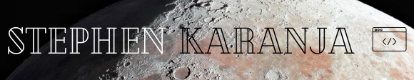

# 👋🏾 Hey, I'm Steve!👋

<!--
**SKaranjaN/SKaranjaN** is a ✨ _special_ ✨ repository because its `README.md` (this file) appears on your GitHub profile.

Here are some ideas to get you started:

- 🔭 I’m currently working on ...
- 🌱 I’m currently learning ...
- 👯 I’m looking to collaborate on ...
- 🤔 I’m looking for help with ...
- 💬 Ask me about ...
- 📫 How to reach me: ...
- 😄 Pronouns: ...
- ⚡ Fun fact: ...
-->

I'm a software engineer with a love for backend web development. I'm currently working with Django a Python framework to create easy-to-use and beautiful web apps.

<table>
  <tr>
    <td align="center">
        <h3>💫 Fun Facts</h3>
        
☕️ <strong>JavaScript</strong> was the first programming language I learned!

        
🚴🏾 When I'm not coding, you'll likely find me cycling.

         
    </td>
    <td align="center">
        <h3>💻 Languages & Tools</h3>
        
    </td>
  </tr>
    <!-- <td colspan="2" align="center"> 
        <h3>🌐 Let's Connect!</h3> 
    </td> -->
  </tr>
</table>
